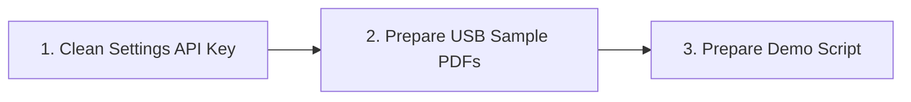
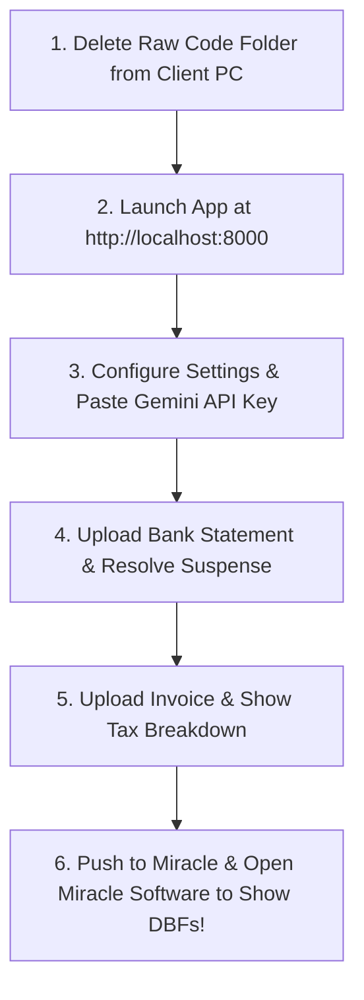
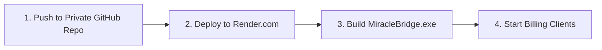

# 📋 Master Action Checklist: What To Do Next

Here is your exact, step-by-step roadmap of what to do right now, tomorrow during the client demo, and after the demo.

---

## 🎯 PHASE 1: Right Now (Today's Preparation)

- [x] **Local Agent Code Created**: `backend/miracle_bridge_agent.py` and `backend/build_bridge_exe.py` are ready.
- [ ] **Revoke Old API Key**: Go to [Google AI Studio](https://aistudio.google.com/) and revoke any API key shared previously in `settings.json`.
- [ ] **Prepare Demo Samples**: Save 1 sample Bank Statement PDF and 1 Sales/Purchase Invoice PDF on a USB drive or phone.

---

## 🎯 PHASE 2: Tomorrow's Client Meeting & Demo Workflow

1. **Delete Old Files**: Remove the previous uncompiled `.zip` and folder from the client's desktop.
2. **Launch Application**: Start app at `http://localhost:8000`.
3. **Configure Settings**: Set Miracle Base Path to client's Miracle folder (`C:\Miracle` or `C:\CMP0005`), set active fiscal year (`YR25`), paste Gemini API Key.
4. **Live Bank Demo**: Upload Bank PDF $\rightarrow$ Show 0.05s extraction $\rightarrow$ Click **Resolve Suspense**.
5. **Live Invoice Demo**: Upload Sales/Purchase PDF $\rightarrow$ Show auto-calculated CGST/SGST/IGST breakdown.
6. **The "WOW" Moment**: Click **Push to Miracle**, open Miracle Accounting Software in front of the client, and show the injected vouchers in `RKACCT41.DBF` and `RKACCT01.DBF`.
7. **Present Offer**: Pitch the **₹12,000 / year (₹1,000 / month)** subscription package.

---

## 🎯 PHASE 3: Production Cloud Rollout (After Meeting)

1. **Push to GitHub**: Push code to a **Private GitHub Repository**.
2. **Deploy on Render**: Create a Free Web Service ($0/mo) on [Render.com](https://render.com/) to get your live web URL (`https://miracle-ai-app.onrender.com`).
3. **Build `MiracleBridge.exe`**: Run `python backend/build_bridge_exe.py` on Windows PC to compile the 5MB local agent installer.
4. **Start Collecting Payments**: Deliver the Render Web URL + `MiracleBridge.exe` to paid clients and collect ₹10,000 – ₹12,000 upfront per year!
