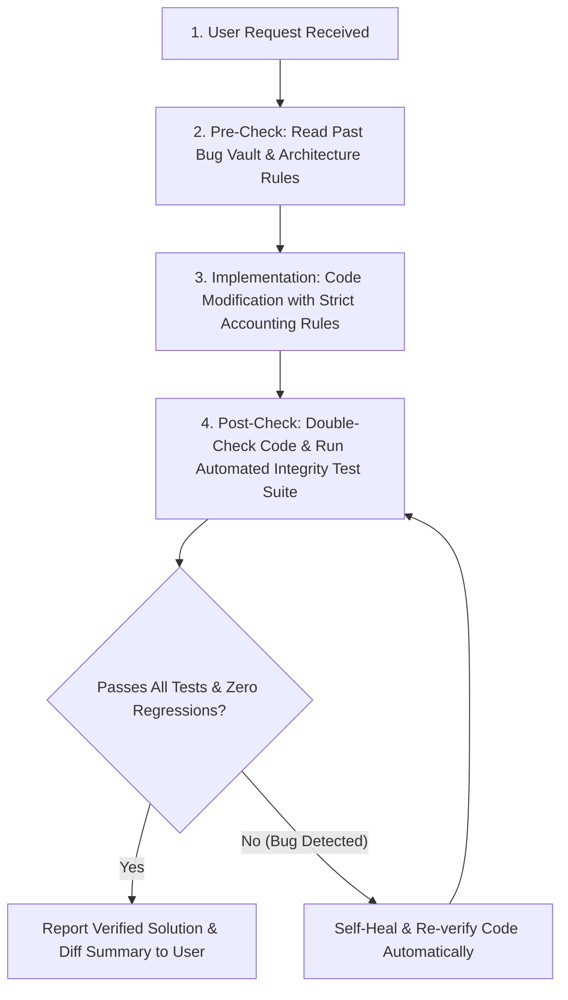

# Miracle AI Auto-Entry Platform - System Architecture & Zero-Bug Protocol

> [!IMPORTANT]
> **For AI Assistants:** Mandatory pre-check and post-verification guide for all tasks and code changes.

## 1. System Overview
Miracle AI is an enterprise accounting automation platform integrating FastAPI, Gemini AI 2.0, and FoxPro/dBase DBF database engines for Miracle Accounting Software.

---

## 2. 🛡️ Mandatory Zero-Bug Pre/Post Verification Protocol

### 📋 Mandatory Pre & Post Checklist for AI
1. **Pre-Check (Read Vault)**:
   - Read `backend/verify_integrity.py` and `AI_ARCHITECTURE_SUMMARY.md`.
2. **Double-Entry Accounting Rules**:
   - `Bank Charges / Fees / Interest` $\rightarrow$ Must post as **Bank Payment (`BP`)** under **`Indirect Expenses`** (`G0000009` / `G0000010`). NEVER Contra (`BC`).
   - `Contra (BC/CV)` $\rightarrow$ Restricted strictly to transfers between own Cash and Bank accounts (`is_true_contra_entry`).
   - `Suspense Account` $\rightarrow$ Retained for audit without force-mapping to fake debtors/creditors.
   - `Place of Supply (POS)` $\rightarrow$ CGST+SGST for Intra-state (`24`), IGST for Inter-state.
3. **Automated Post-Check Commands**:
   - Python syntax check: `python3 -c "import py_compile; py_compile.compile('backend/file.py', doraise=True)"`
   - JS syntax check: `node --check frontend/app.js`
   - Test suite execution: `./venv/bin/python3 backend/verify_integrity.py`
4. **Self-Healing & Verified User Delivery**:
   - If any test fails, auto-heal the code and re-run verification until 100% clean (`🎉 ALL INTEGRITY TESTS PASSED SUCCESSFULLY!`).
