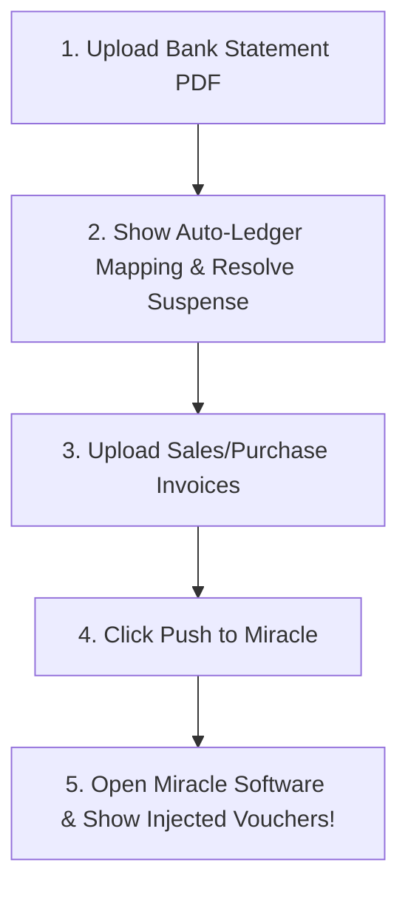
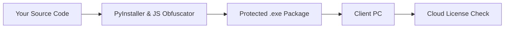

# 📋 Tomorrow's Client Meeting Plan & Future Distribution System

---

## 🎯 PART 1: Tomorrow's Client Visit & Demo Script

When you meet the client tomorrow, follow this step-by-step plan:

### 1️⃣ Pre-Meeting Setup (Before You Go)
- Revoke the old API key in Google AI Studio.
- Have a valid Gemini API key ready on your phone/laptop to enter into the app during the demo.
- Bring a sample Bank Statement PDF and sample Sales/Purchase Invoice PDF on a USB drive or phone.

---

### 2️⃣ When You Arrive at the Client's Office / PC
1. **Clean up the old raw code folder**:
   - Tell the client: *"I am replacing the setup folder with the official testing build."*
   - Delete the previous `.zip` file and unzipped source folder from their PC.
2. **Launch the Application**:
   - Start the backend and open `http://localhost:8000`.
   - Go to **⚙️ Settings**:
     - Set **Miracle Base Path** to their actual Miracle accounting directory (e.g., `C:\Miracle` or `C:\CMP0005`).
     - Enter the active client ID (`CMP0005`) and fiscal year (`YR25`).
     - Paste the working Gemini API Key and click **Save Settings**.

---

### 3️⃣ Live Demonstration Flow (Show These 3 Main Features)

#### A. Bank Statement Auto-Entry Demo:
- Click **Bank Statements** tab $\rightarrow$ Upload sample bank statement PDF.
- Show extracted transactions: Date, Withdrawal, Deposit, Balance, Narration.
- Show status badges (`Mapped`, `Auto-Create`, `Review`).
- Click **Resolve Suspense** to show how easy it is to assign unknown expenses to ledgers.

#### B. Sales & Purchase Invoices Demo:
- Click **Sales Vouchers** or **Purchase Vouchers** tab $\rightarrow$ Upload Invoice PDF.
- Point out:
  - Automatic vendor GSTIN detection.
  - Automatic line-item math breakdown (Taxable value, CGST, SGST, IGST).
  - Single discount calculation.

#### C. The "WOW" Moment — Push to Miracle DBF:
- Click **Push to Miracle**.
- Show the success confirmation popup.
- **Open Miracle Accounting Software in front of the client**:
  - Go to Voucher Display $\rightarrow$ Show the newly injected Sales/Purchase/Bank vouchers with exact amounts and narrations!
  - Show them how hours of manual data entry were completed in 5 seconds.

---

### 4️⃣ Closing the Meeting & Next Steps
- Ask the client for feedback on their specific workflow.
- Discuss pricing (e.g. ₹5,000 – ₹15,000 / year per Miracle client license).
- Tell them: *"The production version will be delivered as an automated `.exe` installer locked to your office computer."*

---

## 🔒 PART 2: Future Distribution System (For All New Clients)

To ensure **0% code theft** for all future clients, we will use a **3-Tier Distribution Architecture**:

---

### 🏛️ Tier 1: One-Click Automated Build System
Instead of sending `.py` files, we will create a build script (`build_production.py` / `build_production.bat`):
1. Runs **PyInstaller** to compile Python into binary native modules (`.exe` / `.pyd`).
2. Runs **JavaScript Obfuscator** to scramble `app.js` into unreadable code.
3. Automatically deletes all `.py` files from the output package.

---

### 🔐 Tier 2: Machine Hardware Lock (Serial Binding)
Every future build will include a **Hardware License Validator**:
- On first launch on the client's PC, the app reads the client's **CPU ID** or **HDD Serial Number**.
- Generates a unique `MACHINE_KEY`.
- The client sends you their `MACHINE_KEY`.
- You generate a `LICENSE.KEY` file bound to their computer and an expiration date (e.g. 1 Year License).
- **Result**: The app WILL NOT work if copied to another computer!

---

### ☁️ Tier 3: Hosted Cloud API Proxy
Instead of putting your Gemini API Key inside the client's machine:
- We set up a lightweight Cloud Proxy (e.g., on a ₹400/month VPS or AWS).
- The app sends extraction requests to YOUR cloud server.
- Your cloud server checks if the client has paid their monthly/yearly subscription.
- If paid $\rightarrow$ forwards request to Gemini AI and returns extracted data.
- If unpaid $\rightarrow$ rejects request.

---

## 🛠️ Checklist For Next Client Onboarding
- [ ] Send ONLY the compiled `.exe` release build (never raw folder).
- [ ] Obfuscate `app.js`.
- [ ] Provide client license agreement (EULA).
- [ ] Bind license key to client's hardware serial.
