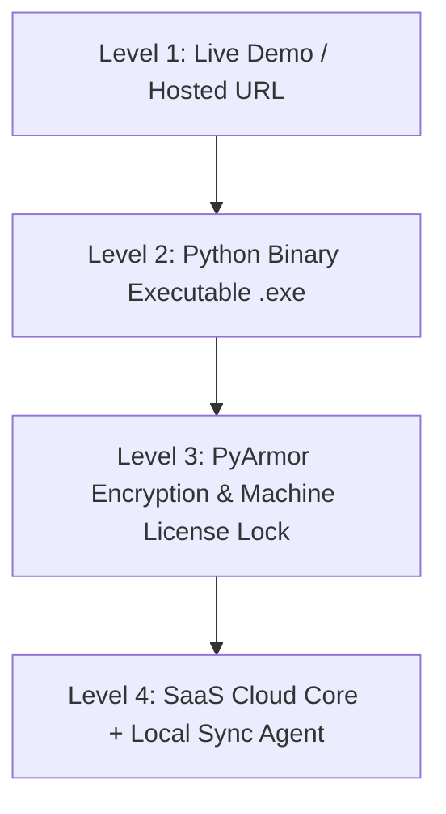

# 🛡️ Source Code Protection & Commercial Distribution Guide

If you give raw Python (`.py`) and JavaScript (`.js`) source code to a client or tester, **there is a high risk** they could copy your code, hire another developer to modify it, or resell it under their own brand.

This guide details **how to protect your Intellectual Property (IP)**, prevent code theft, and safely deliver your Miracle AI Auto-Entry tool to clients and testers.

---

## 🚨 Risk Analysis: Why Raw Source Code is Dangerous

When you share raw folder files:
1. Anyone can view, copy, and modify your Python scripts (`main.py`, `gemini_service.py`, `dbf_handler.py`).
2. Your custom Gemini prompts, accounting algorithms, and DBF writing logic become public.
3. A client could remove your copyright/branding and sell it to other businesses without paying you.

---

## 🛡️ 4 Levels of Protection (From Instant to Enterprise)



---

### 🌐 LEVEL 1: Zero Code Exposure (Best for Initial Demos & Testing)

Do **NOT** send files to the client's PC.

1. **Option A — Screen Share Demo**:
   - Demonstrate the software over Zoom, Google Meet, or Microsoft Teams while running it on your computer.
2. **Option B — Remote Interactive Testing (AnyDesk / TeamViewer)**:
   - Let the client test the software on *your* machine or test server via AnyDesk/TeamViewer.
3. **Option C — Hosted Cloud Demo (Ngrok / Cloud Server)**:
   - Host the web backend on your cloud server or expose your local port securely using `ngrok`:
     ```bash
     ngrok http 8000
     ```
   - Give the client the `https://xxxx.ngrok-free.app` URL. They can test the UI in their browser without ever seeing backend `.py` files!

---

### 📦 LEVEL 2: Package into Binary Executables (`.exe` / `.app`)

If the client **must** run the software locally on their Windows PC (because Miracle DBF files are on their machine):

#### 1. Python Backend $\rightarrow$ Compiled Binary (`.exe`)
Convert `.py` files into an executable binary using **PyInstaller**. The source code is compiled into C-extensions / bytecode.

```bash
pip install pyinstaller

# Build compiled single-file Windows executable (run on Windows PC)
pyinstaller --noconfirm --onedir --windowed --name "MiracleAI" backend/main.py
```

#### 2. Frontend JavaScript Minification & Obfuscation
Minify `frontend/app.js` using `javascript-obfuscator` so your code cannot be read or reverse-engineered:

```bash
npm install -g javascript-obfuscator
javascript-obfuscator frontend/app.js --output frontend/app.min.js --compact true --self-defending true
```

---

### 🔒 LEVEL 3: PyArmor Encryption & Hardware Machine Locking (Professional Protection)

To prevent a client from copying the binary `.exe` to another computer or hiring a developer to decompile Python bytecode, use **PyArmor**.

#### Features of PyArmor:
- **AES Code Encryption**: Encrypts Python code into dynamic native binary modules (`.pyd` / `.so`).
- **Hard Expiration Date**: Set trial period (e.g. software automatically stops working after 14 days or on Dec 31).
- **Hardware Binding (Machine Lock)**: Bind the license key to the client's **CPU ID**, **Hard Disk Serial Number**, or **MAC Address**. The software will NOT run on any other computer even if copied!

#### Example PyArmor Commands:
```bash
pip install pyarmor

# 1. Encrypt Python backend with PyArmor
pyarmor gen --output dist_protected backend/main.py

# 2. Bind license to a specific hard disk serial number or CPU ID
pyarmor licenses --bind-disk "SERIAL-NUMBER-1234" --expired "2026-12-31" reg_code.lic
```

---

### ☁️ LEVEL 4: Commercial SaaS Architecture (Ultimate Solution)

If you plan to sell this software to dozens or hundreds of accounting firms:

1. **Keep Core AI Backend on Cloud Server**:
   - Host FastAPI + Gemini AI Engine on AWS / DigitalOcean / Hetzner.
2. **Lightweight Local DBF Bridge**:
   - Give the client only a small, closed-source local bridge agent (`.exe`) that reads/writes DBF files locally and communicates with your Cloud API.
3. **Monthly / Yearly Subscription Model**:
   - You control subscription access. If a client stops paying, their API key / license is revoked remotely.

---

## 📑 Legal & Business Safeguards

Before sending any demo or binary build:

1. **Non-Disclosure Agreement (NDA)**: Have the client sign a mutual NDA stating that all software, algorithms, and workflows remain your sole property.
2. **Trial / Software License Agreement (EULA)**:
   - State clearly: *"This trial software is licensed, not sold. Reverse engineering, decompilation, redistribution, or resale is strictly prohibited."*
3. **Remove Development & Internal Documentation**:
   - Do NOT include `docs/`, `AI_RULES.md`, `.agents/`, or git history in any zip given to a client. Only send the compiled production release build.

---

## 🛠️ Summary Recommendation Checklist

| Scenario | Recommended Approach | Code Risk |
|---|---|---|
| **First Demo to Client** | Live Screen Share or Ngrok URL (`https://yourname.ngrok.io`) | **0% Risk** |
| **Testing on Client's PC** | PyInstaller `.exe` + Obfuscated JS (`app.min.js`) | **Very Low Risk** |
| **Paid Client License** | PyArmor + Machine ID Binding + Hardware Serial Lock | **Zero Copy Risk** |
| **Commercial Product Launch** | Cloud SaaS Backend + Local DBF Bridge | **Enterprise Grade Security** |
