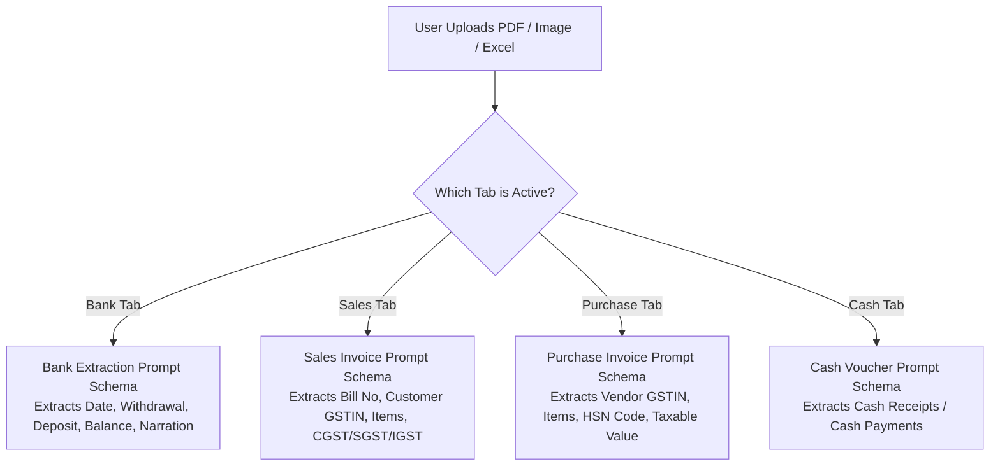
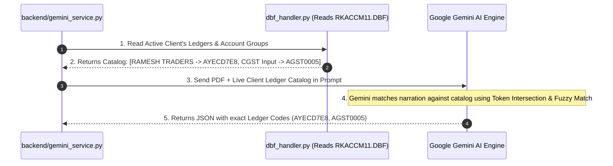

# 🧠 How Gemini AI Understands Documents & Formats Accounting Data

This guide explains **how Google Gemini AI knows what data to extract**, **how it maps client ledgers (`RKACCM11.DBF`)**, and **how it formats structured JSON for Miracle DBF injection**.

---

## 🎯 1. How Gemini AI Knows What Document Is Uploaded

When a document is uploaded, `gemini_service.py` attaches a **Strict Structured JSON Schema Prompt** based on the active tab selected by the user:



---

## 🔍 2. How Gemini Maps Ledger Names to Miracle Account Codes (`RKACCM11.DBF`)

How does Gemini know that `UPI/RAMESH TRADERS/129381` belongs to ledger code `AYECD7E8` in Miracle?

### The 3-Step Ledger Mapping Process:



1. **Step 1: DBF Catalog Reading**: `dbf_handler.py` reads `RKACCM11.DBF` (Account Group Tree) from the active client folder (`CMP0005`). It builds a live dictionary of all party names, bank accounts, and expense ledgers.
2. **Step 2: Ledger Injection into AI Prompt**: `gemini_service.py` feeds this live catalog directly into Gemini's prompt context:
   > *"Here is the client's active Miracle ledger list: [State Bank of India (G0000004), Ramesh Traders (G0000009), Tea Expenses (G0000024), CGST Output (AGST0008)]..."*
3. **Step 3: Keyword & Token Intersection Matching**: Gemini analyzes narrations (e.g. `CHQ PAID TO RAMESH TRADERS`) and matches them to `Ramesh Traders` (`AYECD7E8`).
   - If a narration says `PETROL EXPENSE`, Gemini automatically classifies it under `Indirect Expenses` (`G0000024`).

---

## 🧮 3. How Gemini Guarantees 100% Double-Entry Math Balance

Before returning data to the frontend grid, `gemini_service.py` runs **Mathematical Double-Check Verification**:

### A. For Bank Statements:
$$\text{Opening Balance} - \text{Total Withdrawals} + \text{Total Deposits} = \text{Closing Balance}$$
If the balance doesn't match to exact 0.00, `gemini_service.py` flags missing transaction rows and re-reads the page.

### B. For Sales / Purchase Invoices:
$$\text{Taxable Value} + \text{CGST} + \text{SGST} + \text{IGST} + \text{Round-off} = \text{Total Invoice Amount}$$
- **Single Discount Header Rule**: Item discounts are set to `0.0`, and invoice discounts post to `EDVAS00095` (`DISCOUNT A/C`) to prevent double-counting.

---

## 📋 4. What Structured Data Gemini Sends to the Backend

Gemini returns a clean JSON response object:

```json
{
  "status": "success",
  "document_type": "sales_invoice",
  "vouchers": [
    {
      "voucher_date": "2026-05-15",
      "party_name": "RAMESH TRADERS",
      "party_code": "AYECD7E8",
      "invoice_number": "INV-2026-089",
      "taxable_amount": 10000.00,
      "cgst_amount": 900.00,
      "sgst_amount": 900.00,
      "igst_amount": 0.00,
      "round_off": 0.00,
      "total_amount": 11800.00,
      "narration": "Sales Invoice INV-2026-089"
    }
  ]
}
```

This clean JSON payload is what gets displayed on your editable web grid, and when the user clicks **Push to Miracle**, it gets sent to `MiracleBridge.exe` to write directly into `RKACCT41.DBF` and `RKACCT01.DBF`!
