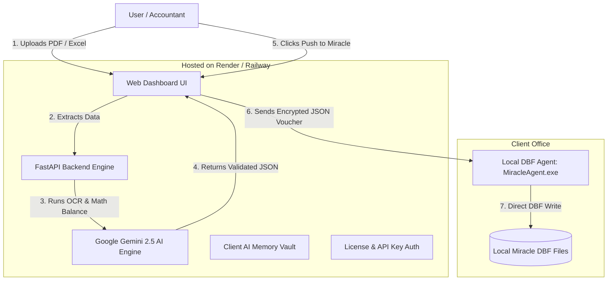

# ☁️ Hybrid System Architecture & Cloud Hosting Guide (Render / Vercel)

This guide explains how to build a **Hybrid Cloud System** for Miracle AI Auto-Entry using cloud hosting platforms like **Render**, **Railway**, or **Vercel**.

---

## 💡 What is a Hybrid System & Why Do You Need It?

### The Core Problem:
- **Miracle DBF files** (`RKACCT41.DBF`, `RKACCT01.DBF`) exist **locally** on the client's Windows PC (`C:\Miracle\CMP0005\YR25`).
- A web server in the cloud (Vercel/Render) **cannot directly touch files** inside a client's computer hard drive over the internet due to browser & OS security boundaries.

### The Hybrid Solution:
Split the system into two connected parts:
1. **Cloud Server (Render / Railway)**: Holds 100% of your IP, Gemini AI engine, algorithms, user UI, memory vault, and license checks.
2. **Local Sync Agent (`MiracleAgent.exe`)**: A tiny (5MB) background agent running on the client's Windows PC that receives ready entries from the cloud and writes them into local Miracle `.DBF` files.

---

## 🏗️ Hybrid Architecture Overview



---

## ⚡ Benefits of the Hybrid System

| Feature | Local Only App | Hybrid System (Cloud + Agent) |
|---|---|---|
| **Source Code Protection** | ❌ High risk of source code theft | ✅ **100% Safe** (Core AI code stays on Cloud) |
| **API Key Security** | ❌ Key stored on client PC | ✅ **100% Secured** inside Cloud server |
| **Updates & Fixes** | ❌ Must re-install on client PC | ✅ **Instant Cloud Update** (Update once, all clients get it) |
| **Subscription Control** | ❌ Hard to revoke | ✅ **Remote Kill Switch** (Disable client in 1 click) |
| **Miracle DBF Access** | ✅ Direct write | ✅ Direct write via Local Agent |

---

## 📊 Platform Comparison: Render vs Vercel vs Railway

| Platform | FastAPI Support | WebSockets / Local Sync | Best Used For | Recommendation |
|---|---|---|---|---|
| **Render** (`render.com`) | ⭐⭐⭐⭐⭐ Full Python/FastAPI support | ✅ Supported | Full Backend + API Proxy + UI | 🏆 **RECOMMENDED** |
| **Railway** (`railway.app`) | ⭐⭐⭐⭐⭐ Full Python/FastAPI support | ✅ Supported | Full Backend + DB | 🏆 **RECOMMENDED** |
| **Vercel** (`vercel.com`) | ⭐⭐⭐ Serverless execution limits (15s timeout) | ❌ Limited WebSocket | Frontend HTML/JS only | ⚠️ Good for UI only |

---

## 🚀 How to Deploy on Render (Step-by-Step)

### Step 1: Create a `render.yaml` Configuration File
Place this file in your project root:

```yaml
services:
  - type: web
    name: miracle-ai-backend
    env: python
    buildCommand: "pip install -r backend/requirements.txt"
    startCommand: "cd backend && uvicorn main:app --host 0.0.0.0 --port $PORT"
    envVars:
      - key: GEMINI_API_KEY
        sync: false
```

### Step 2: Push Code to GitHub / GitLab (Private Repository)
Make sure your repository is **PRIVATE** so nobody else can access your repository.

### Step 3: Deploy on Render.com
1. Log in to **[Render.com](https://render.com/)**.
2. Click **New +** $\rightarrow$ Select **Web Service**.
3. Connect your private GitHub repository.
4. Set **Environment Variables**:
   - `GEMINI_API_KEY` = `Your_Actual_Gemini_Key`
5. Click **Create Web Service**.

Render will give you a public URL like:
👉 **`https://miracle-ai-backend.onrender.com`**

---

## 💻 The Local DBF Sync Agent (`MiracleAgent.exe`)

The local agent is a lightweight 5MB Python script compiled into a `.exe` using PyInstaller.

### How the Local Agent Works:
1. Runs silently in the Windows System Tray on the client's PC.
2. Listens on `http://localhost:9123` or connects to your Cloud Server via WebSockets.
3. When the user clicks **Push to Miracle** on the cloud web app (`https://miracle-ai-backend.onrender.com`), the web app sends the voucher JSON payload to `http://localhost:9123/inject`.
4. The local agent writes the entries directly to `RKACCT41.DBF` and `RKACCT01.DBF` on the local machine.

#### Minimal Code Structure for `local_agent.py`:
```python
from fastapi import FastAPI, HTTPException
from fastapi.middleware.cors import CORSMiddleware
import dbf

app = FastAPI()

# Allow requests from your Render Cloud domain
app.add_middleware(
    CORSMiddleware,
    allow_origins=["https://miracle-ai-backend.onrender.com"],
    allow_methods=["*"],
    allow_headers=["*"],
)

@app.post("/inject")
def inject_dbf(payload: dict):
    # Reads local DBF path and writes voucher entries
    dbf_path = payload.get("dbf_path")
    vouchers = payload.get("vouchers")
    # ... Local DBF write logic ...
    return {"status": "success", "written": len(vouchers)}

if __name__ == "__main__":
    import uvicorn
    uvicorn.run(app, host="127.0.0.1", port=9123)
```

---

## 🎯 Summary Roadmap for Hybrid Deployment

1. **Phase 1 (Testing / Demos)**: Host FastAPI backend on **Render.com** (Free/Low-cost tier) and expose UI via Render URL.
2. **Phase 2 (Production)**: Compile `local_agent.py` into `MiracleAgent.exe` for client PCs.
3. **Phase 3 (Monetization)**: Control client access, subscriptions, and API keys 100% from your cloud dashboard on Render.
