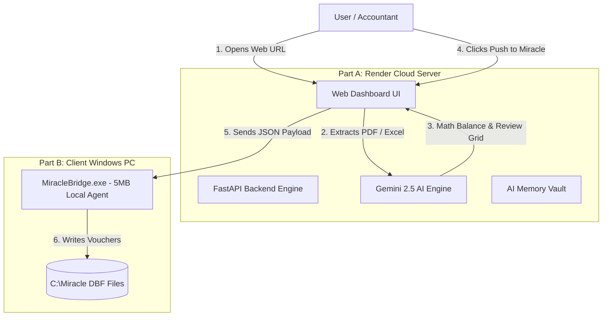
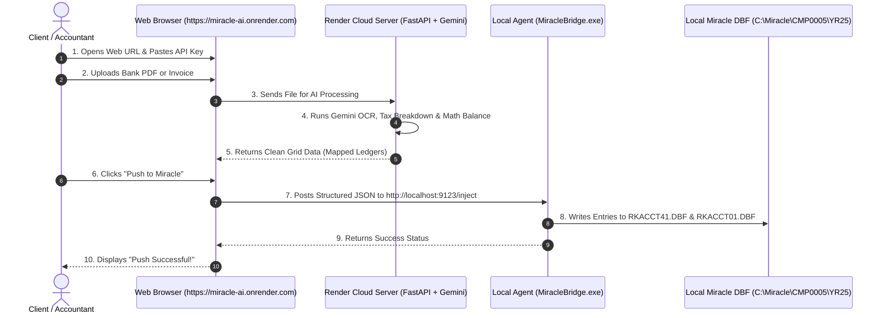
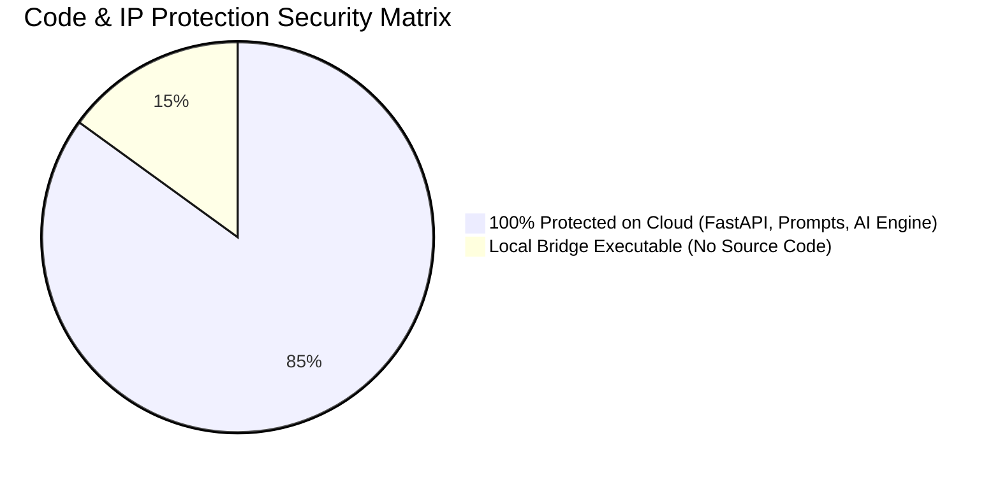

# 📚 Complete Master Explainer: How Render & The Hybrid System Work

This document is a comprehensive, easy-to-understand breakdown of **Render.com** and the **Hybrid System Architecture**.

---

## 💡 PART 1: What is Render.com and Why Use It?

### 1. What is Render?
Think of **Render.com** as a powerful computer sitting in a high-security data center running **24 hours a day, 7 days a week**.

Instead of starting the backend on your laptop by running `python main.py`, **Render runs your Python backend in the cloud**.

Render provides a public, secure Web URL:
👉 **`https://miracle-ai-app.onrender.com`**

### 2. Why is Render Crucial for Code Protection?
When you host your app on Render:
- **Your Source Code is 100% Protected**: All `.py` files (`gemini_service.py`, `dbf_handler.py`, FastAPI routers, prompts, rules) stay locked inside Render's private server.
- **Clients Cannot Copy or Steal Code**: Clients only interact with the web interface in their browser (`https://...`). They **NEVER** get access to your Python source code.
- **Your API Keys & Memory Vault are Safe**: Stored as environment variables and secure cloud files on Render.

---

## ⚡ PART 2: What is the Hybrid System?

### The Core Problem
Miracle Accounting Software stores its data in legacy Visual FoxPro database files (`.DBF`) located on the client's local Windows PC:
📁 `C:\Miracle\CMP0005\YR25\RKACCT41.DBF`

For security reasons, web browsers (like Chrome or Edge) **strictly forbid any website on the internet (`https://...`) from touching or editing files on a computer's local hard drive**.

---

### The Hybrid Architecture Solution

To solve this, we divide the application into **Two Connected Parts**:

| Component | Where It Runs | What It Handles |
|---|---|---|
| **Part A: Render Cloud Server** | Cloud Server (`https://...`) | Web Dashboard UI, Gemini AI extraction, math balance validation, accounting rules, memory vault. |
| **Part B: Local Bridge Agent** | Client Windows PC (`http://localhost:9123`) | A tiny 5MB executable (`MiracleBridge.exe`) running in Windows system tray. Receives vouchers from Render and writes them directly to local `.DBF` files. |

---

## 🔄 PART 3: The 7-Step Complete Transaction Execution Flow

Here is the exact step-by-step process of what happens when a client uses the tool:

### Detailed Breakdown of Each Step:

1. **Step 1 — Access App**: Client opens `https://miracle-ai-app.onrender.com` in Google Chrome or Edge.
2. **Step 2 — Settings**: Client enters their active Miracle Client ID (`CMP0005`), Fiscal Year (`YR25`), and their own Gemini API Key.
3. **Step 3 — Document Upload**: Client drags & drops a Bank Statement PDF or Sales/Purchase Invoice onto the web screen.
4. **Step 4 — Cloud AI Parsing**: The web page sends the PDF to your FastAPI backend on Render. Render uses Gemini AI to extract dates, narrations, amounts, and tax breakdowns.
5. **Step 5 — Grid Review**: The user sees the extracted rows on their browser screen. They can edit fields, resolve suspense ledgers, or add new party accounts.
6. **Step 6 — Click "Push to Miracle"**: The user clicks the **Push to Miracle** button.
7. **Step 7 — Local DBF Injection**:
   - The browser sends a JSON payload to `http://localhost:9123/inject` (which is listening locally on the client's machine).
   - `MiracleBridge.exe` creates an automatic zip backup in `/BACKUPS/`.
   - `MiracleBridge.exe` writes the header voucher in `RKACCT41.DBF` and double-entry lines in `RKACCT01.DBF`.
   - The entry appears inside Miracle Accounting Software instantly!

---

## 🛡️ PART 4: Code Protection & Security Summary

- **Render Cloud Server**: Holds **85% of your codebase** (all Python AI engines, FastAPI endpoints, prompt rules, DBF mapping logic). **No client can ever download or see these files.**
- **Local Client Machine**: Holds **15% of helper logic** (a tiny compiled `.exe` agent with no core AI logic).
- **Your Result**: **100% IP Security** + **Zero API Key Leakage** + **Complete Control Over Client Subscriptions**.
