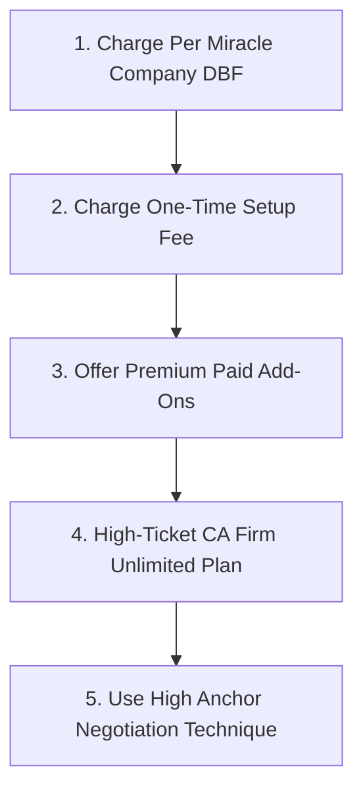

# 🚀 Maximum Pricing Strategy: How to Charge ₹25,000 to ₹1.5 Lakhs+ Per Client

To extract the **MAXIMUM possible revenue** from every client, CA firm, and business owner, you must stop selling your app as "cheap software" and start selling it as a **High-Value Enterprise Productivity Engine**.

---

## 🎯 The 5 Rules of Maximum Pricing



---

### 1️⃣ Strategy 1: "Per-Company DBF" Pricing Model (Scales to Lakhs)

CA firms have anywhere from **10 to 100 client companies** inside Miracle (`CMP0001`, `CMP0002`, `CMP0003`, etc.).

Do **NOT** charge a flat rate for an entire CA firm. Charge **Per Company DBF**:

- **Base Platform Fee**: **₹10,000 / year** (Includes 3 Company DBFs).
- **Additional Company DBFs**: **₹2,000 to ₹3,000 per company DBF / year**.

#### 💰 Math Example for a CA Firm with 30 Clients:
- Base Platform Fee: ₹10,000
- 27 Extra Client Companies × ₹2,500 = ₹67,500
- **Total Annual Bill: ₹77,500 / year from just ONE CA firm!**

---

### 2️⃣ Strategy 2: One-Time Setup & Onboarding Fee (Upfront Cash)

Whenever a new client signs up, charge a **Mandatory One-Time Setup & Implementation Fee**:

- **Setup Fee**: **₹5,000 to ₹10,000 one-time**
- **What you deliver**: You help them configure their active client base paths, standard accounting group hierarchies (`G0000024`, `G0000023`), custom GST ledgers (`AGST0001` - `AGST0010`), and test their first 3 bank PDFs.

> 💡 **Why this works**: Clients expect IT software to have an setup/installation fee. This gives you **instant cash on Day 1**!

---

### 3️⃣ Strategy 3: Premium High-Margin Add-On Modules

Charge extra for specialized features:

| Add-On Feature | What It Does | Extra Price to Charge |
|---|---|---|
| **AI Memory Vault Trainer** | Remembers custom bank narrations & vendor mappings permanently | **+ ₹5,000 / year** |
| **Multi-User / Staff Access** | Allows 5 junior accountants to work simultaneously | **+ ₹10,000 / year** |
| **VIP Phone & WhatsApp AMC** | Direct priority support & automatic DBF schema updates | **+ ₹15,000 / year** |
| **Custom Excel / Tally Importer** | Imports custom non-standard Excel invoice layouts | **+ ₹8,000 one-time** |

---

### 4️⃣ Strategy 4: High-Ticket Enterprise Plan for Manufacturers & Distributors

Large traders and manufacturers handle **2,000+ sales invoices & purchase bills per month**.

For these big clients, charge an **Enterprise Custom Package**:
- **Price**: **₹1,000,000 to ₹1,50,000 per year** (or **₹10,000 to ₹15,000 / month**).
- **Pitch**: *"Your accounting department is spending ₹40,000/month on manual typing. Our enterprise system replaces 90% of that workload for ₹12,000/month."*

---

### 5️⃣ Strategy 5: The "Anchor Price" Sales Negotiation Technique

When you present your pricing quote to a client, **always present 3 options** side-by-side:

```mermaid
flowchart LR
    Anchor[Option 1: Enterprise Unlimited\n₹1,50,000 / year\n(Anchor - High Price)]
    Target[Option 2: Professional CA Suite\n₹45,000 / year\n(TARGET CHOICE - Looks Cheap!)]
    Basic[Option 3: Single Business Starter\n₹15,000 / year\n(Basic - Entry)]
```

#### Why Anchor Pricing Works:
- When the client sees **Option 1 (₹1,50,000)** first, their brain gets anchored to ₹1.5 Lakhs.
- When they see **Option 2 (₹45,000)**, it feels like a **huge bargain**!
- 70% of clients will automatically choose Option 2 (₹45,000 / year).

---

## 📈 Maximum Annual Income Projection

| Customer Type | Number of Clients | Price Charged Per Client | Total Annual Income |
|---|---|---|---|
| **Small Businesses** | 10 | ₹15,000 / year | **₹1,50,000** |
| **Medium CA Firms** | 10 | ₹45,000 / year | **₹4,50,000** |
| **Large CA Firms / Distributors** | 5 | ₹1,00,000 / year | **₹5,00,000** |
| **Setup Fees (25 Clients)** | 25 | ₹5,000 one-time | **₹1,25,000** |
| **TOTAL ANNUAL REVENUE** | **25 Clients Total** | — | 🏆 **₹12,25,000 (12.25 Lakhs!)** |

---

## 📋 Summary Formula to Maximize Every Deal

1. **Always charge an upfront Setup Fee** (₹5,000 – ₹10,000).
2. **Charge Per Miracle Company DBF** (₹2,500 / company / yr).
3. **Offer High-Ticket Anchor Pricing** (Present ₹1.5 Lakhs anchor option first).
4. **Sell Annual Upfront Packages** (Collect 100% cash upfront on Day 1).
