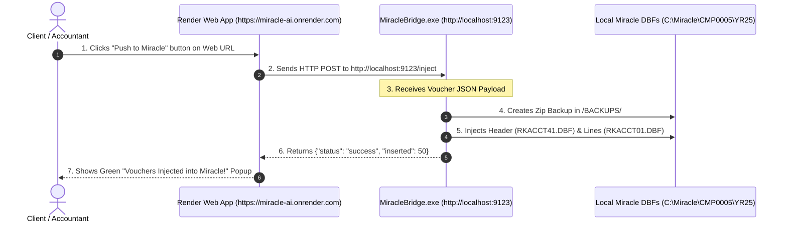

# 🔌 Complete Guide: What is `MiracleBridge.exe` and How Does It Work?

This guide explains **`MiracleBridge.exe`**: what it is, why it is needed, how it works, and how to build & install it for your clients.

---

## ❓ 1. What is `MiracleBridge.exe`?

`MiracleBridge.exe` is a tiny (5MB) background program that runs on your client's Windows computer.

### Why do we need `MiracleBridge.exe`?
- Miracle Accounting software stores its data inside **local database files (`.DBF`)** on the client's computer (e.g. `C:\Miracle\CMP0005\YR25\RKACCT41.DBF`).
- Security rules in web browsers (Chrome, Edge, Firefox) **prevent any website on the internet (`https://...`) from touching local files on a computer hard drive**.
- `MiracleBridge.exe` acts as a **Local Bridge / Translator**: It receives extracted vouchers from your Render cloud web URL and writes them directly into the client's local `.DBF` files!

---

## ⚡ 2. How Does `MiracleBridge.exe` Work Step-by-Step?



### Detailed Execution Flow:

1. **Client Starts Computer**: `MiracleBridge.exe` launches automatically in the background (sits silently in the Windows System Tray).
2. **Listening on Localhost**: It listens on port `9123` (`http://localhost:9123`).
3. **User Clicks "Push to Miracle"**: On the Render web app screen (`https://miracle-ai.onrender.com`), when the user clicks **Push to Miracle**, JavaScript sends a background message to `http://localhost:9123/inject`.
4. **Automatic ZIP Backup**: Before modifying any data, `MiracleBridge.exe` creates a pre-push backup of the client's `CMP0005/YR25` folder inside `/BACKUPS/`.
5. **Direct DBF Write**: `MiracleBridge.exe` uses `dbfread` / `dbf` Python engines to write:
   - Voucher Headers into `RKACCT41.DBF`
   - Double-Entry Lines into `RKACCT01.DBF`
   - Memo Narrations into `RKACCT40.DBF`
6. **Instant Miracle Update**: When the client opens Miracle Accounting Software, the vouchers appear immediately!

---

## 🛠️ 3. How to Build `MiracleBridge.exe` (Source Code)

Creating `MiracleBridge.exe` takes **less than 10 lines of python code** combined with your existing `dbf_handler.py`.

### Source Code (`local_bridge.py`):
```python
from fastapi import FastAPI, HTTPException
from fastapi.middleware.cors import CORSMiddleware
import uvicorn
import dbf_handler  # Uses your existing DBF engine

app = FastAPI(title="Miracle Local DBF Bridge")

# Allow requests from your Render Cloud Web URL
app.add_middleware(
    CORSMiddleware,
    allow_origins=["https://miracle-ai-app.onrender.com", "http://localhost:8000"],
    allow_methods=["*"],
    allow_headers=["*"],
)

@app.get("/status")
def check_status():
    """Health check to confirm local bridge is running on client PC"""
    return {"status": "online", "bridge_version": "1.0.0"}

@app.post("/inject")
def inject_vouchers(payload: dict):
    """Receives structured vouchers from Render and writes to local DBF"""
    try:
        miracle_path = payload.get("miracle_path")
        client_id = payload.get("client_id")
        year_folder = payload.get("year_folder")
        vouchers = payload.get("vouchers")

        # Call existing DBF Handler push logic
        result = dbf_handler.push_staged_vouchers(miracle_path, client_id, year_folder, vouchers)
        return {"status": "success", "result": result}
    except Exception as e:
        raise HTTPException(status_code=500, detail=str(e))

if __name__ == "__main__":
    uvicorn.run(app, host="127.0.0.1", port=9123)
```

---

## 📦 4. How to Compile `local_bridge.py` into `MiracleBridge.exe`

Run this command on a Windows PC to generate the single `.exe` file:

```cmd
pip install pyinstaller
pyinstaller --noconfirm --onefile --windowed --name "MiracleBridge" local_bridge.py
```

### Result:
You get a single file: **`MiracleBridge.exe`** (approx. 5 MB to 10 MB).

---

## 💻 5. How the Client Installs & Uses `MiracleBridge.exe`

1. **One-Time Client Setup**:
   - You send `MiracleBridge.exe` to your client.
   - The client double-clicks `MiracleBridge.exe` once.
   - You add `MiracleBridge.exe` to their Windows `Startup` folder so it launches automatically whenever their computer turns on.
2. **Everyday Usage**:
   - The client never needs to configure anything in `MiracleBridge.exe`.
   - They just open `https://miracle-ai-app.onrender.com` in Chrome/Edge.
   - They upload bank PDFs and click **Push to Miracle**.
   - `MiracleBridge.exe` handles DBF injection silently in the background!

---

## 🛡️ 6. Code Security of `MiracleBridge.exe`

Does `MiracleBridge.exe` leak your source code? **NO!**

- `MiracleBridge.exe` contains **ZERO AI logic**, **ZERO Gemini prompts**, **ZERO AI Memory Vaults**, and **ZERO API Keys**.
- It is only a simple database file writer.
- All your AI intelligence, prompts, and business logic stay **100% safe on Render Cloud**.
