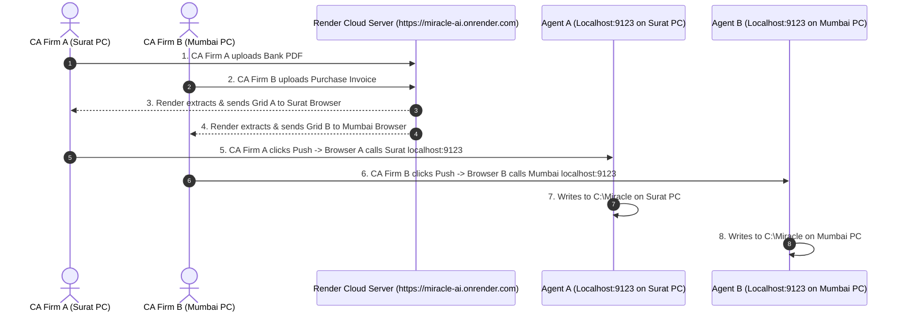

# 🏢 Multi-Client Architecture & `MiracleBridge.exe` Delivery Guide

This guide explains **where to find `build_bridge_exe.py`**, **how to send `MiracleBridge.exe` to clients**, and **how 10+ different clients can use the Render Web URL at the exact same time** without any issues.

---

## 📁 1. Where is `build_bridge_exe.py` & How to Send to Clients?

### Location of File:
The build script is located inside your project backend directory:
📁 [`backend/build_bridge_exe.py`](file:///Users/jaydevnakum/Work%20Place/WORK/APP%20DETAILS/Mirracle%20Auto%20Entre%20Sale%20or%20Purchase%20or%20Bank/backend/build_bridge_exe.py)

### How to Compile & Deliver to Clients:
1. **Do NOT send Python files (`.py`) to clients!**
2. On a Windows computer, open Command Prompt in the `backend/` directory and run:
   ```cmd
   python build_bridge_exe.py
   ```
3. PyInstaller will create a folder named `dist/` containing:
   📦 **`dist/MiracleBridge.exe`** (approx. 5 MB)
4. Send **ONLY `MiracleBridge.exe`** to your client via WhatsApp, Google Drive, or email.

---

## ⚡ 2. How 10+ Different Clients Work Simultaneously on Render

You might wonder: *If 10 different CA firms open `https://miracle-ai-app.onrender.com` at the exact same time, how does Render keep their data separate? Will any data get mixed up?*

**ANSWER: NO! Data will NEVER get mixed up.**

Here is the exact technical explanation of how multi-client isolation works:



---

### Why Multi-Client Isolation is 100% Guaranteed:

1. **Independent Browser Sessions**:
   - When CA Firm A opens `https://miracle-ai-app.onrender.com`, their browser holds Session A.
   - When CA Firm B opens `https://miracle-ai-app.onrender.com`, their browser holds Session B.
   - Render processes each request in isolated memory threads.

2. **Localhost Request Routing**:
   - `http://localhost:9123` ALWAYS refers to the **local computer that opened the browser**.
   - When CA Firm A in Surat clicks **Push to Miracle**, their browser communicates ONLY with `http://localhost:9123` on the Surat computer.
   - When CA Firm B in Mumbai clicks **Push to Miracle**, their browser communicates ONLY with `http://localhost:9123` on the Mumbai computer.
   - **Data from CA Firm A can NEVER reach CA Firm B!**

3. **Render Server Scalability**:
   - FastAPI on Render uses asynchronous multi-worker technology (`uvicorn`).
   - It can process hundreds of incoming PDF extractions from 50 different clients at the exact same second without lag!

---

## 📋 Summary Rules

1. **File Location**: `backend/build_bridge_exe.py`
2. **Build Output**: `dist/MiracleBridge.exe`
3. **What You Send to Client**: Send ONLY `MiracleBridge.exe` (Never send Python scripts).
4. **Multi-Client Isolation**: 100% safe. Every client's browser connects ONLY to their own local `localhost:9123` for DBF pushes.
