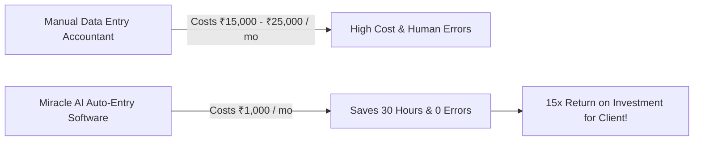
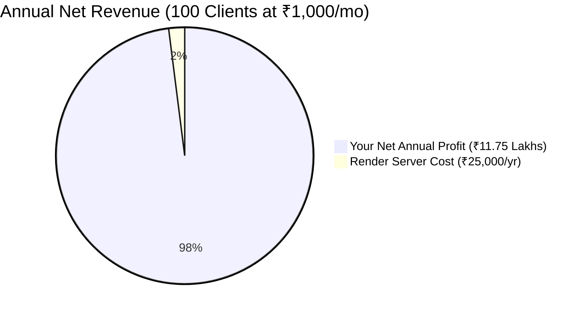
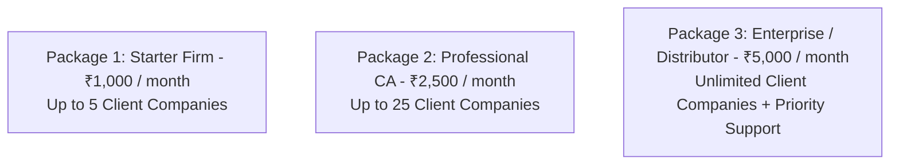

# 💎 Premium Pricing Strategy Guide (₹1,000/Month & Beyond)

---

## 🎯 YES! Charging ₹1,000 / Month (₹12,000 / Year) is 100% Justified!

You are **absolutely right**. ₹5,000/year (₹415/month) was a conservative estimate. 

For the time savings, math precision, and instant DBF injection your software provides, **₹1,000 per month (₹12,000 per year)** is **very affordable for CA firms and businesses**, and gives them an incredible Return on Investment (ROI).

---

## 💡 Why Clients Will Gladly Pay ₹1,000 / Month

### The ROI Pitch to Your Clients:
1. **Accountant Salary Saved**: A junior data entry operator costs **₹15,000 to ₹25,000 per month**.
2. **Time Saved**: Entering 500 bank transactions and 200 purchase bills into Miracle takes **25+ hours**. Your app does it in **15 minutes**.
3. **Zero Errors**: Manual entry causes GST discrepancies and tax mistakes. Your AI tool ensures **100% debit/credit math balance**.

> **Sales Pitch line**: *"You are saving ₹15,000 in monthly labor costs for just ₹1,000 a month. You make your money back on Day 2 of every month!"*

---

## 📊 Revenue & Net Profit at ₹1,000 / Month (₹12,000 / Year)

Because the client uses **their own Gemini API key** and your backend is hosted on **Render**, your costs are practically **₹0**. Almost 100% of your revenue becomes **PURE PROFIT**!

| Number of Active Clients | Monthly Revenue (at ₹1,000/mo) | Annual Revenue (at ₹12,000/yr) | Render Server Cost / Year | Your Annual Net Profit |
|---|---|---|---|---|
| **5 Clients** | ₹5,000 | ₹60,000 | ₹0 (Free Tier) | **₹60,000** |
| **10 Clients** | ₹10,000 | ₹1,20,000 | ₹7,000 ($7/mo) | **₹1,13,000** |
| **25 Clients** | ₹25,000 | ₹3,00,000 | ₹7,000 ($7/mo) | **₹2,93,000** |
| **50 Clients** | ₹50,000 | ₹6,00,000 | ₹7,000 ($7/mo) | **₹5,93,000** |
| **100 Clients** | **₹1,00,000** | **₹12,00,000** | ₹25,000 ($25/mo) | **₹11,75,000** |

---

## 🏷️ Recommended 3-Tier Pricing Packages

Instead of offering just one price, offer **3 Packages** to maximize your income:

### 1️⃣ Package 1: Single Firm / Small CA (Starter)
- **Price**: **₹1,000 / month** (or **₹10,000 / year** if paid upfront annually).
- **Includes**: Up to 5 Miracle client company DBFs (`CMP0001` to `CMP0005`), Bank Statements, Sales, Purchases, Cash, Opening Balances.

### 2️⃣ Package 2: Professional CA / Accounting Agency
- **Price**: **₹2,500 / month** (or **₹25,000 / year** if paid upfront annually).
- **Includes**: Up to 25 Miracle client companies (`CMP0001` to `CMP0025`), priority extraction, dedicated AI memory storage.

### 3️⃣ Package 3: Large Enterprise / Super Distributor
- **Price**: **₹5,000 / month** (or **₹50,000 / year** upfront).
- **Includes**: Unlimited Miracle client companies, custom ledger rules, dedicated cloud bridge.

---

## 💡 Pro Business Tips for Selling

1. **Offer 2 Months Free on Annual Upfront Payment**:
   - Monthly: ₹1,000 / month (Total ₹12,000).
   - Annual Upfront: **₹10,000 / year** (Save ₹2,000!).
   - **Why this works**: Clients love saving money, and you collect **₹10,000 cash upfront on Day 1!**

2. **Free 7-Day Trial**:
   - Give clients 7 days free on the Render Web URL link. Once they see 500 bank entries populated in 5 seconds, they will never want to go back to manual typing!
