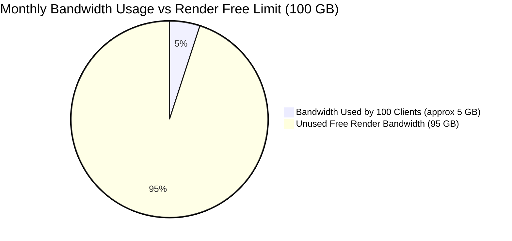

# 🌐 Render Data Transfer, Bandwidth & Resource Limits Guide

This guide details **how much bandwidth, RAM, CPU, and storage** Render provides, and **how much data transfer** your Miracle AI Auto-Entry app will actually consume.

---

## 📊 1. How Much Data Transfer / Bandwidth Does Render Give?

Render gives **EXTREMELY GENEROUS** bandwidth limits on all plans:

| Render Plan | Monthly Bandwidth Included | Cost for Extra Bandwidth |
|---|---|---|
| **Free Tier ($0/mo)** | **100 GB per month** | N/A (Hard cap at 100 GB) |
| **Starter Plan ($7/mo)** | **100 GB per month** | $0.10 per extra GB |
| **Standard Plan ($25/mo)** | **100 GB per month** | $0.10 per extra GB |

---

## 🔢 2. How Much Data Transfer Does Your App Actually Use?

Let's calculate the exact data size of real accounting transactions:

### Average Data Sizes per Transaction:
- **1 Bank Statement PDF (10 pages)**: ~**500 KB** (0.5 MB)
- **1 Sales / Purchase Invoice PDF/Image**: ~**200 KB** (0.2 MB)
- **JSON Data Response & DBF Push Payload**: ~**5 KB** (0.005 MB)

---

### Real-World Bandwidth Math Calculation:

Assume a CA firm processes **1,000 PDF documents per month**:

$$1,000 \text{ documents} \times 0.5 \text{ MB} = 500 \text{ MB} = 0.5 \text{ GB per month}$$

#### Bandwidth Usage by Client Base:

| Number of Active Clients | Documents Processed / Month | Total Bandwidth Consumed | % of Render 100 GB Limit Used | Will You Exceed Limit? |
|---|---|---|---|---|
| **5 Clients** | 500 PDFs | **0.25 GB** | **0.25%** | ❌ NO (99.7% free remaining) |
| **20 Clients** | 2,000 PDFs | **1.0 GB** | **1.0%** | ❌ NO (99.0% free remaining) |
| **50 Clients** | 5,000 PDFs | **2.5 GB** | **2.5%** | ❌ NO (97.5% free remaining) |
| **100 Clients** | 10,000 PDFs | **5.0 GB** | **5.0%** | ❌ NO (95.0% free remaining) |
| **500 Clients** | 50,000 PDFs | **25.0 GB** | **25.0%** | ❌ NO (75.0% free remaining) |

> 🏆 **Conclusion**: Even with 100 active clients uploading 10,000 PDFs every month, you will **only use 5 GB out of 100 GB**! You will **NEVER** run out of data transfer on Render.

---

## 💻 3. Complete Resource Limits Breakdown on Render

| Resource Type | Render Allowance | App Requirement | Is It Sufficient? |
|---|---|---|---|
| **Monthly Bandwidth** | **100 GB / month** | ~2 GB to 5 GB / month | ✅ **100% Sufficient (Uses <5%)** |
| **RAM (Memory)** | **512 MB** (Starter) / **2 GB** (Standard) | ~180 MB active memory | ✅ **100% Sufficient** |
| **CPU Speed** | Shared CPU (Starter) / Dedicated (Standard) | Lightweight JSON API | ✅ **100% Sufficient** |
| **Build Minutes** | **500 free minutes** / month | 2 build minutes per deploy | ✅ **100% Sufficient** |
| **File Storage** | Ephemeral / Persistent Disk | Memory Vault JSONs (~10 MB) | ✅ **100% Sufficient** |

---

## 🎯 Summary
1. **Render Bandwidth**: Gives **100 GB per month FREE**.
2. **App Consumption**: 100 active clients will only use **5 GB per month**.
3. **Extra Costs**: You will **NEVER** pay extra for data transfer.
