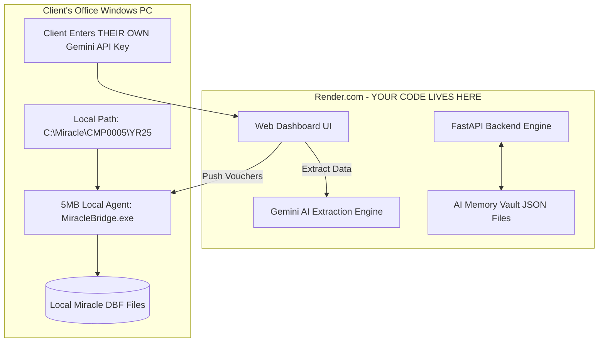
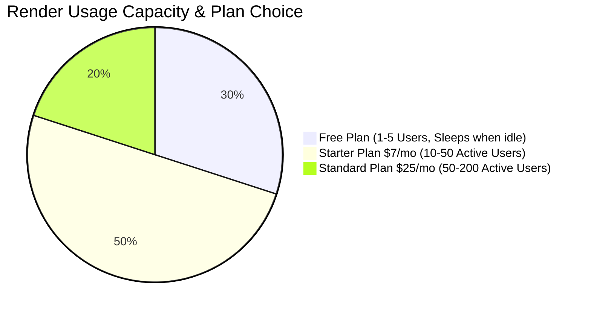

# 🎯 Expert Recommendation & Render Pricing Guide

---

## 🏆 If I Were in Your Place: What Is My Choice?

If I were building and selling this Miracle AI Auto-Entry tool, **I would choose the HYBRID SYSTEM WITH CLIENT API KEY KEYING**.

Here is the exact setup I would use:

---

## 🌟 Why This Specific Setup is Perfect for You:

### 1. **Client Uses THEIR OWN Gemini API Key (Zero Cost for You)**
- On the web UI Settings screen, the client enters their **own free Google Gemini API Key**.
- **Benefit**: You pay **₹0** for Gemini AI API processing! All extraction costs are charged directly to the client's own Google account.

### 2. **Miracle Base Path Remains LOCAL on Client's PC**
- The Miracle DBF path (`C:\Miracle\CMP0005\YR25`) is set inside the local bridge agent running on the client's machine.
- **Benefit**: Writes directly into Miracle DBF without exposing files to the internet.

### 3. **AI Memory Vault JSON Saved on Render**
- Can we store `CMPxxxx_memory.json` on Render? **YES!**
- Render has **Persistent Disks** (or you can use Render environment storage / MongoDB / Supabase).
- When a client maps a bank narration (e.g. `UPI-RAMESH-TRADERS` $\rightarrow$ `RAMESH ENTERPRISES`), that memory is saved in `AI_Memory_Vault` on Render.
- Next time any client uploads a statement, Render remembers the mapping!

### 4. **100% Code Protection**
- All your Python code (`gemini_service.py`, `dbf_handler.py`, accounting rules) stays on **Render Cloud**.
- The client NEVER gets your source code, so they **cannot copy or resell it**.

---

## 💰 Render Pricing & User Capacity (How Many People Use Before Going Paid?)

Render offers both a **Free Tier** and **Paid Tiers**.

---

### 1️⃣ Render FREE Plan (Good for Testing & Demos)
- **Cost**: **$0 / month** (100% FREE)
- **Included**: 750 free compute hours per month, 512 MB RAM, 100 GB bandwidth.
- **Capacity**: Can handle **1 to 5 active users** testing simultaneously.
- **Limitation (Idle Sleep)**:
  - If no one uses the web app for 15 minutes, Render puts the server to **sleep**.
  - When the next client opens the URL, it takes **30 seconds to wake up** on the first click.

---

### 2️⃣ Render STARTER Plan (Recommended When You Have Paid Clients)
- **Cost**: **$7 / month** (approx. **₹580 / month**)
- **Included**: 512 MB RAM, 1 Shared CPU, **Never Sleeps (Stays 24/7 Awake)**.
- **Capacity**: Easily handles **20 to 50 active clients** processing statements daily.
- **Why upgrade**:
  - No 30-second delay on first load.
  - Smooth 24/7 instant response for your clients.

---

### 3️⃣ Render STANDARD Plan (For Growing Business)
- **Cost**: **$25 / month** (approx. **₹2,070 / month**)
- **Included**: 2 GB RAM, 1 Dedicated CPU, High Performance.
- **Capacity**: Handles **100 to 250 active clients** daily.

---

## 📊 Cost vs Income Matrix (Your Business Profit)

If you charge each client **₹5,000 per year** (approx ₹415/month):

| Number of Paid Clients | Your Monthly Revenue | Render Server Cost | Gemini AI Cost | Your Monthly NET PROFIT |
|---|---|---|---|---|
| **1 Client (Testing)** | ₹500 | ₹0 (Free Tier) | ₹0 (Client's API key) | **+ ₹500** |
| **5 Clients** | ₹2,500 | ₹0 (Free Tier) | ₹0 (Client's API key) | **+ ₹2,500** |
| **10 Clients** | ₹5,000 | ₹580 ($7 Starter) | ₹0 (Client's API key) | **+ ₹4,420** |
| **50 Clients** | ₹25,000 | ₹580 ($7 Starter) | ₹0 (Client's API key) | **+ ₹24,420** |
| **100 Clients** | ₹50,000 | ₹2,070 ($25 Plan) | ₹0 (Client's API key) | **+ ₹47,930** |

---

## 📋 Summary of What To Do Next

1. **Use the Hybrid System**: Cloud Backend on Render + Client API Key + Local DBF Sync Agent.
2. **Start on Render Free Tier**: Test with your first 1–5 clients for **$0 cost**.
3. **Upgrade to Render $7/month** once you have your first 2–3 paying clients.
4. **All Python source code remains 100% safe on your Cloud Server.**
