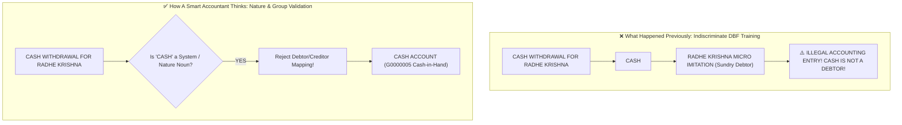

# 🧠 Smart Accountant Engine: Nature-Based Mapping & Protection Rules

This document details the **Nature-Based Accounting Safeguards** that prevent generic keywords (`CASH`, `COMPUTER`, `DAIRY`, `PETROL`, `RENT`, `SALARY`) from ever being wrongly mapped to specific persons, debtors, or creditors (`MITESHBHAI`, `Mom`, `RADHE KRISHNA MICRO IMITATION`, `J P VARMA`).

---

## 🚨 The Core Accounting Issue Explained

In your Memory Vault Manager screenshots:
- `CASH` was mapped to `RADHE KRISHNA MICRO IMITATION` (⚠️ WRONG!)
- `COMPUTER` was mapped to `MITESHBHAI` (⚠️ WRONG!)
- `DAIRY` was mapped to `Mom` (⚠️ WRONG!)
- `DEVSHREE` was mapped to `J P VARMA` (⚠️ WRONG!)



---

## 🏛️ How A Smart Accountant Thinks Before Mapping

A professional accountant evaluates 3 things before creating a ledger mapping rule:

### 1. Nature of Keyword (System Mode / Asset / Expense vs Person)
- Generic transaction modes (`CASH`, `CHEQUE`, `ATM`, `TRANSFER`, `UPI`, `NEFT`, `RTGS`) are **System Modes**.
- Generic assets (`COMPUTER`, `LAPTOP`, `MOBILE`, `CAR`, `VEHICLE`, `PRINTER`) are **Fixed Assets**.
- Generic operational expenses (`SALARY`, `RENT`, `TEA`, `PETROL`, `FUEL`, `ELECTRICITY`, `INTEREST`, `BANK CHARGES`) are **Expenses**.

> **RULE**: Generic System/Asset/Expense keywords MUST NEVER map to a **Sundry Debtor / Sundry Creditor** (a specific person like `MITESHBHAI` or `Mom`)!

### 2. Group Nature Compatibility
Before saving a mapping rule:
- If key = `CASH` $\rightarrow$ Target Ledger MUST belong to `G0000005` (`Cash-in-Hand`).
- If key = `COMPUTER` $\rightarrow$ Target Ledger MUST belong to `G0000006` (`Fixed Assets`) or `Indirect Expenses`.
- If key = `PETROL` / `FUEL` $\rightarrow$ Target Ledger MUST belong to `G0000024` (`Indirect Expenses`).
- If target group is `G0000009` (`Sundry Debtors`) or `G0000013` (`Sundry Creditors`), key MUST be a **Specific Business / Person Name**, NEVER a generic noun!

### 3. Memory Vault Purification & Self-Healing
Any existing invalid mappings inside client memory JSON files (e.g. `CASH` $\rightarrow$ `RADHE KRISHNA...`, `COMPUTER` $\rightarrow$ `MITESHBHAI`) are automatically purged during vault cleanup!

---

## 🛡️ Protected Keywords Inventory

```python
PROTECTED_NATURE_KEYWORDS = {
    # System Transaction Modes
    "CASH", "CHEQUE", "CHQ", "ATM", "TRANSFER", "ONLINE", "PAYMENT", "RECEIPT", 
    "DEPOSIT", "NEFT", "RTGS", "UPI", "IMPS", "EFT", "POS", "CARD", "INTERNET BANKING",
    
    # Generic Assets & Equipment
    "COMPUTER", "COMPUTERS", "LAPTOP", "PRINTER", "MOBILE", "CAR", "VEHICLE", 
    "MACHINE", "EQUIPMENT", "FURNITURE", "ASSET",
    
    # Generic Operational Expenses
    "SALARY", "SALARIES", "RENT", "TEA", "REFRESHMENT", "PETROL", "FUEL", 
    "ELECTRICITY", "TELEPHONE", "INTEREST", "BANK CHARGES", "DEPOSITORY", 
    "COMMISSION", "DISCOUNT", "DAIRY", "COSMOFEED"
}
```

---

## 🏆 Resulting Memory Vault Quality

| Keyword / Search Pattern | Previous Wrong Mapping | Smart Nature-Based Mapping | Status |
|---|---|---|---|
| `CASH` | `RADHE KRISHNA MICRO IMITATION` | **Purged / `CASH ACCOUNT`** | ✅ Fixed |
| `COMPUTER` | `MITESHBHAI` | **Purged / `COMPUTER EXPENSES`** | ✅ Fixed |
| `DAIRY` | `Mom` | **Purged / `DAIRY EXPENSES`** | ✅ Fixed |
| `CAR VEHICLE` | `VEHICLE EXP` | `VEHICLE EXP` | ✅ Valid |
| `BUS` | `TRAVELLING EXP` | `TRAVELLING EXP` | ✅ Valid |
