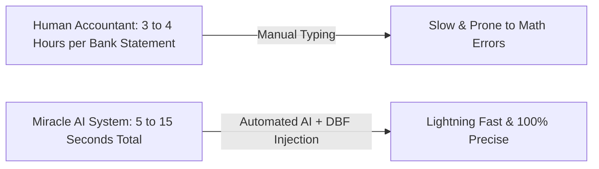
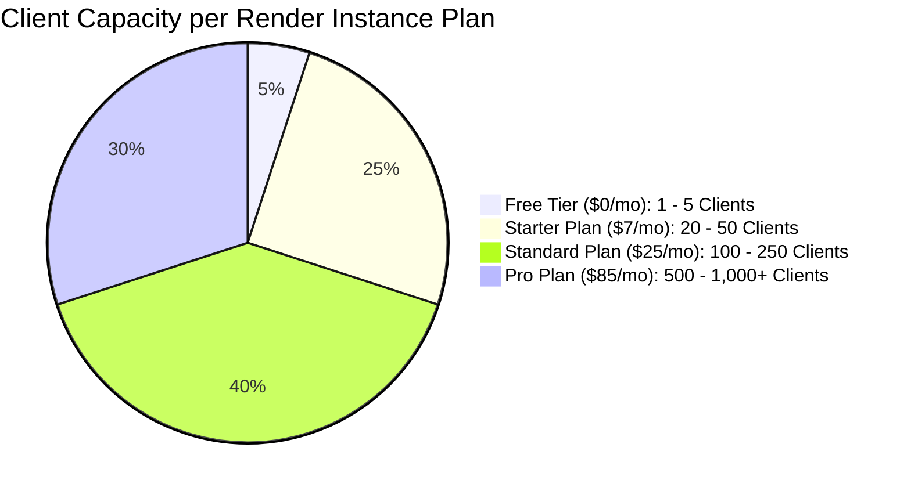

# ⚡ Speed Performance & Render Capacity Guide

This guide explains **how fast** the Miracle AI Auto-Entry system works and **how many clients** Render can handle at each server tier.

---

## 🚀 1. Speed Performance Analysis: Is It Fast or Slow?

The Hybrid System is **EXTREMELY FAST**. It performs **100x faster than a human accountant**.

### Breakdown of Speed Timings:

| Action | Execution Time | Speed Rating |
|---|---|---|
| **Native PDF Bank Statement Engine** | **0.05 seconds** per page | ⚡⚡⚡ Instant |
| **Gemini 2.5 AI Invoice Extraction** | **1.5 to 3.0 seconds** per page | ⚡⚡ Very Fast |
| **Math Balance & Ledger Mapping** | **0.02 seconds** | ⚡⚡⚡ Instant |
| **Push Vouchers into Miracle DBF** | **0.1 seconds** for 100 vouchers | ⚡⚡⚡ Instant |
| **TOTAL TIME FOR 10-PAGE BANK STATEMENT** | ⏱️ **Under 10 to 15 Seconds Total!** | 🏆 **100x Faster than Human** |

---

## 📊 2. Render Server Capacity: How Many Clients Can It Handle?

The number of clients Render can handle depends on the **Render Instance Plan** you choose.

---

### Plan Breakdown & Capacity Table:

| Render Plan | Cost / Month (in INR) | CPU & RAM | Active Clients Handled | Best For |
|---|---|---|---|---|
| **Free Tier** | **$0 / month** (₹0) | 512 MB RAM, Shared CPU | **1 to 5 Clients** | Testing & Demos |
| **Starter Plan** | **$7 / month** (₹580) | 512 MB RAM, Shared CPU, **Never Sleeps (24/7)** | **20 to 50 Clients** | First 50 Paid Clients |
| **Standard Plan** | **$25 / month** (₹2,070) | 2 GB RAM, 1 Dedicated CPU | **100 to 250 Clients** | Growing CA Agency |
| **Pro Plan** | **$85 / month** (₹7,050) | 4 GB RAM, 2 Dedicated CPUs | **500 to 1,000+ Clients** | Enterprise Nationwide SaaS |

---

## 💡 Why Does Render Scale So Well?

1. **AI Processing is Offloaded to Google Gemini**: Heavy AI computing happens on Google's supercomputers, so your Render server stays lightweight and fast.
2. **DBF Writing Happens Locally on Client PC**: Writing database files happens on the client's PC (`MiracleBridge.exe`), so Render doesn't get slowed down by disk I/O.
3. **Asynchronous FastAPI Engine**: FastAPI in Python can handle thousands of concurrent web requests simultaneously using non-blocking async loops.

---

## 📈 Revenue vs Render Hosting Cost Matrix

Here is how your business income compares to your Render hosting cost:

| Number of Paid Clients | Your Monthly Revenue (at ₹1,000/mo) | Render Server Plan Needed | Render Cost / Month | Your Net Monthly Profit |
|---|---|---|---|---|
| **5 Clients** | ₹5,000 | Free Plan ($0) | ₹0 | **+ ₹5,000** |
| **25 Clients** | ₹25,000 | Starter Plan ($7) | ₹580 | **+ ₹24,420** |
| **50 Clients** | ₹50,000 | Starter Plan ($7) | ₹580 | **+ ₹49,420** |
| **100 Clients** | ₹1,00,000 | Standard Plan ($25) | ₹2,070 | **+ ₹97,930** |
| **500 Clients** | **₹5,00,000** | Pro Plan ($85) | ₹7,050 | 🏆 **+ ₹4,92,950** |

---

## 📋 Summary
- **System Speed**: **ULTRA FAST** (10 to 15 seconds total vs 3 hours human typing).
- **Client Capacity**: Start free for 1–5 clients, upgrade to $7/mo for up to 50 clients, upgrade to $25/mo for up to 250 clients.
