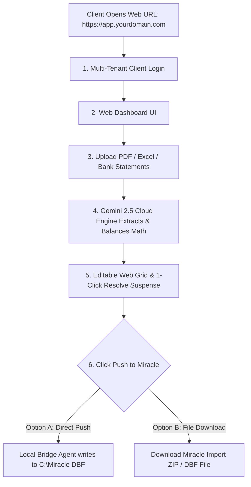

# 🌐 Full Web URL System Guide (100% Cloud Web Application)

This guide details how to host and run the **entire Miracle AI Auto-Entry Platform on a Web URL** (e.g., `https://miracle-ai.onrender.com` or `https://app.yourdomain.com`).

---

## 🎯 How the 100% Web URL System Works

---

## 🚀 Step-by-Step Setup: From Local Code to Web URL

### STEP 1: Deploy Backend + Frontend to Render.com (10 Mins)

1. Create a free account on **[Render.com](https://render.com/)**.
2. Push your project folder to a **Private GitHub Repository**.
3. On Render, click **New +** $\rightarrow$ **Web Service**.
4. Select your GitHub repository.
5. Set Build & Start Commands:
   - **Build Command**: `pip install -r backend/requirements.txt`
   - **Start Command**: `cd backend && uvicorn main:app --host 0.0.0.0 --port $PORT`
6. Add Environment Variable:
   - `GEMINI_API_KEY` = `Your_Secret_Gemini_Key`
7. Click **Deploy**.

Render will immediately assign you a live, SSL-secured Web URL:
👉 **`https://miracle-ai-app.onrender.com`**

---

### STEP 2: Attach Your Custom Domain (Optional)

If you own a domain (e.g., `yourcompany.com`):
1. In Render Dashboard $\rightarrow$ go to **Settings** $\rightarrow$ **Custom Domains**.
2. Add `app.yourcompany.com`.
3. Add a `CNAME` record in GoDaddy / Cloudflare pointing to Render.
4. Now your client accesses: **`https://app.yourcompany.com`**!

---

### STEP 3: How "Push to Miracle" Works from a Web URL

Since web browsers running at `https://app.yourcompany.com` cannot directly write files to `C:\Miracle` on a client's computer hard drive, you have **2 seamless options**:

#### 🟢 Option A: Web-to-Local Bridge (1-Click Push)
- The client installs a tiny 5MB `MiracleBridge.exe` running silently in the Windows system tray (`port 9123`).
- When the user clicks **Push to Miracle** on the Web URL, JavaScript sends a secure request to `http://localhost:9123/inject`.
- The local bridge writes directly to `RKACCT41.DBF` and `RKACCT01.DBF`.
- **User Experience**: 100% web dashboard, 1-click instant DBF push!

#### 🟡 Option B: Miracle DBF / XML Download Bundle
- When the user clicks **Push to Miracle**, the Web URL generates a downloadable zip file containing updated `.DBF` files or Miracle XML Import format.
- The user drops the downloaded file into their Miracle client folder.

---

## 🔒 Security & Code Protection Matrix

When running via Web URL:

| Component | Where It Lives | Security Level |
|---|---|---|
| **Python Backend Engine** | Cloud Server (Render) | 🔒 **100% Protected** (Client cannot see code) |
| **Gemini AI Prompts & Rules** | Cloud Server (Render) | 🔒 **100% Protected** |
| **API Keys** | Cloud Environment Variable | 🔒 **100% Protected** |
| **Accounting Memory Vault** | Cloud Database / JSON | 🔒 **100% Protected** |
| **Client Interface** | Web Browser (`https://...`) | 🌐 **Accessible Anywhere** (PC, Mac, Mobile) |

---

## 💼 Commercial Client Subscription Model

With the Web URL system, you can easily charge clients:
1. **Monthly / Yearly Web Subscription** (e.g., ₹999 / month or ₹9,999 / year per client).
2. **User Accounts**: Give each client their own login username & password.
3. **Usage Dashboard**: Monitor how many bank statements and invoices each client extracts.
4. **Instant Revoke**: Disable client login if subscription expires.
