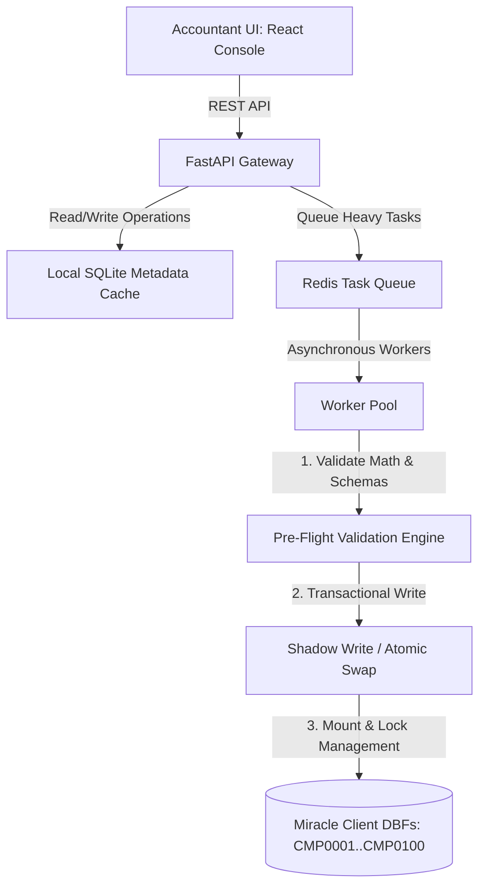

# Enterprise Architecture Design: Multi-Company Accountant System (100+ Clients)

This blueprint outlines how to design, optimize, and secure the Miracle Auto-Entry system for an **accounting firm managing 100+ distinct business clients (companies)**. 

When a single accountant manages 100 different company databases, the primary challenges are **Network Speed (SMB latency)**, **Concurrency (file locks)**, and **Zero-Error Data Integrity (preventing corruption or wrong calculations)**.

---

## 🏗️ System Architecture: The Multi-Company Ledger Engine

To handle 100 clients, the system must shift from direct, synchronous folder writes to a **Local Cache-Backed Task Queue** architecture.

---

## ⚡ Pillar 1: High-Speed Operations over Network Shares (SMB)

### The Challenge
Reading raw DBF files (e.g., scanning `RKACCM01.DBF` to search for ledgers, or scanning `RKACCT01.DBF` for duplicate checks) directly over local SMB network shares is extremely slow due to network latency. If you do this for 100 clients, the app will freeze.

### The Solution: SQLite Metadata Sync Cache
Instead of reading DBF files on every API request, the backend maintains a fast, local **SQLite database** acting as a metadata cache.

1. **Lightweight Sync Cache:** The SQLite database indexes metadata for all 100 clients:
   * **Company Master:** Code, Name, Year Folders.
   * **Ledger Master:** Code, Name, Parent Group (mirrored from `RKACCM01.DBF`).
   * **Last Sync & State:** File hash, last transaction dates, next voucher numbers.
2. **Dynamic Sync Listeners:** A file system watch-dog (like Python's `watchdog` library) monitors the modification times (`mtime`) of client DBFs. If a client's DBF is updated (e.g., inside Miracle), the local SQLite cache updates in background.
3. **Instant Search:** Ledger mapping and duplicate checks are run locally against the SQLite cache in **< 1ms**, instead of reading network DBFs.

---

## 🛡️ Pillar 2: The Zero-Bug & Data Integrity Engine

When writing financial data, there is **zero tolerance for bugs, wrong calculations, or corrupted files**. If a single record is corrupt, the client's Miracle company database will break.

### 1. Pre-Flight Validation Engine (Preventing Wrong Math & Swaps)
Before a single byte is written to the DBF, the data must pass through a strict **Pre-Flight Validation Pipeline**:

* **Double-Entry Balance Guard:** 
  $$\sum \text{Debits} == \sum \text{Credits}$$
  If the sum of Debits does not equal the sum of Credits, the injection task is **aborted**, and the error is flagged.
* **Date & Financial Year Boundaries:** Checks that all transaction dates fall strictly within the active year folder boundary (e.g., `2025-04-01` to `2026-03-31` for `YR26`).
* **Field Width Pre-Truncation:** Inspects field schema widths and truncates strings before writing, preventing FoxPro overflow crashes.

### 2. Shadow Writing & Atomic File Swapping (Zero Database Corruption)
FoxPro DBF files are fragile. If the Python server crashes or loses power mid-write, the DBF file becomes corrupted.

* **Shadow Write:** The system never writes directly to the active `RKACCT41.DBF` or `RKACCT01.DBF`. Instead:
  1. It copies the active DBF to a local temporary shadow file (e.g., `_rkacct01_temp.dbf`).
  2. The worker injects records, builds indices, and closes the shadow file.
  3. The worker runs an integrity check on the shadow file to verify it compiles.
* **Atomic Swap:** Once verified, the active DBF is replaced with the shadow file using atomic OS operations (`os.replace`), reducing the write vulnerability window from seconds to a few **milliseconds**.

### 3. Collision-Free Voucher ID Generation
With 100 clients, we must prevent Voucher ID collisions (`FIELD01`).
* **Namespace ID System:** Generate IDs by prefixing client codes and sequential hash components:
  $$\text{ID} = \text{ModulePrefix (BR/BP/CR/CP)} + \text{CompanyCode (CMP0006)} + \text{Base36 Timestamp}$$
  This guarantees that Voucher IDs are 100% unique, preventing lines from linking to the wrong headers.

---

## 🤖 Pillar 3: AI Narration & Anti-Hallucination Engine

### 1. Dual-Scope Memory Isolation
To prevent Client A's private ledger rules from leaking or mapping onto Client B's statements:
* **Global Memory (Shared):** Maps general utility terms (*Income Tax*, *Swiggy*, *Uber*, *GST Payment*).
* **Isolated Client Memory:** Client-specific names and ledger rules are locked inside that client's namespace in the SQLite DB.

### 2. Strict Python Guard matching
AI mapping results must be validated by a deterministic matching function. If the AI matches a ledger name, the system verifies that the letters of the name exist inside the narration. If they don't, the match is rejected, defaulting to `UPI Debtors` or `Suspense Account`.

---

## 🔄 Reindexing & CDX Maintenance
After every successful atomic swap:
1. The backend triggers a programmatic reindex of the CDX tables.
2. It executes a verification pass on the header (`FIELD12`/`vou_no`) sequence to ensure no gaps or duplicate voucher numbers were generated.
